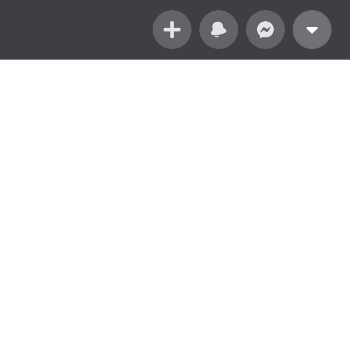

<div align="center">
    <h1> Facebook Navbar UI Clone </h1>
    <p>
      <i>A clone of Facebook's dark theme 2020 navbar </i> 🔲
    </p>
</div>



## Installation

```javascript
// Install node_modules
$ npm install

// start server on localhost
$ npm start
```

## Contributing

Pull requests are welcome. For major changes, please open an issue first to discuss what you would like to change.

## Acknowledgements

- [Advanced Dropdown Menu - React & CSS Animation Tutorial for Beginners by Fireship (video)](https://youtu.be/IF6k0uZuypA)

## Built With

- [React.js](https://reactjs.org/)
